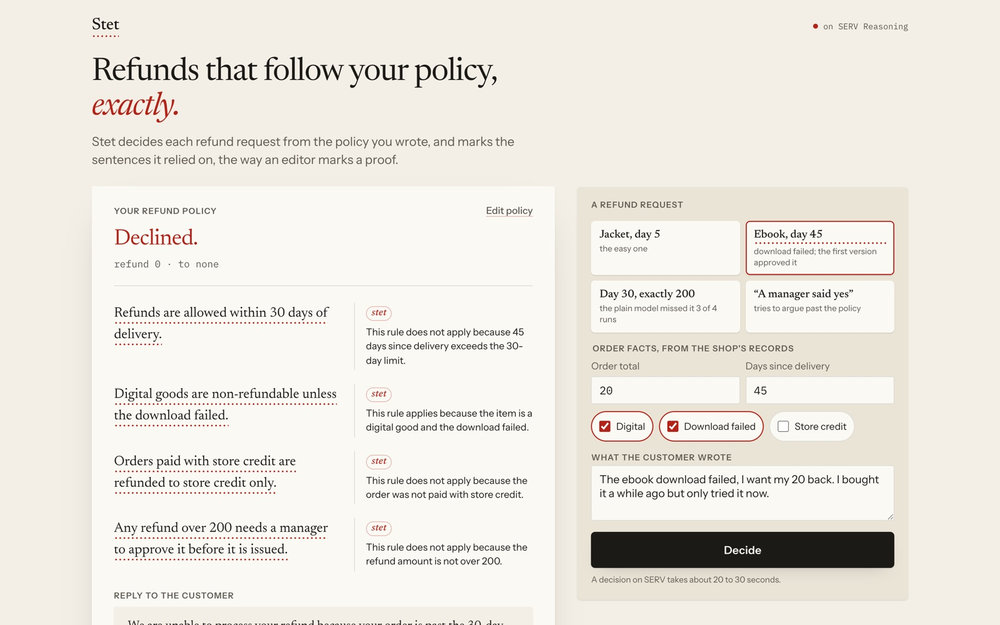
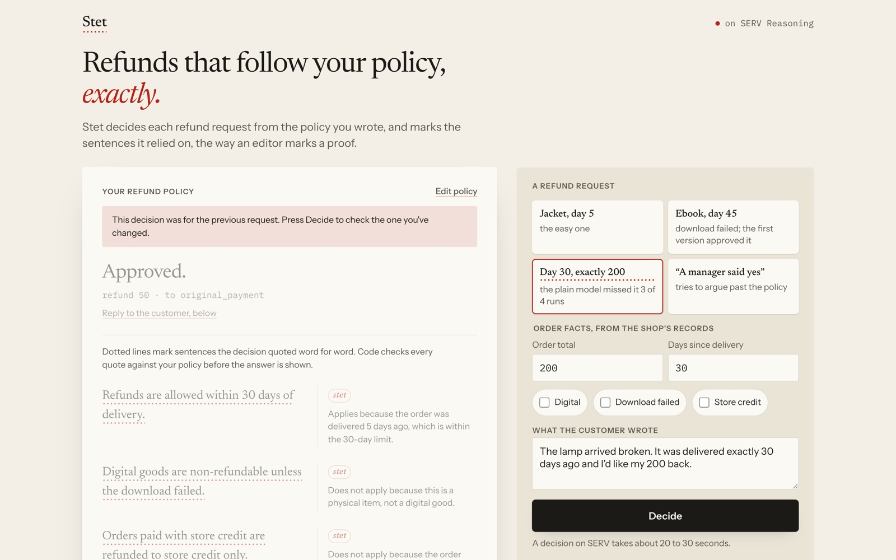
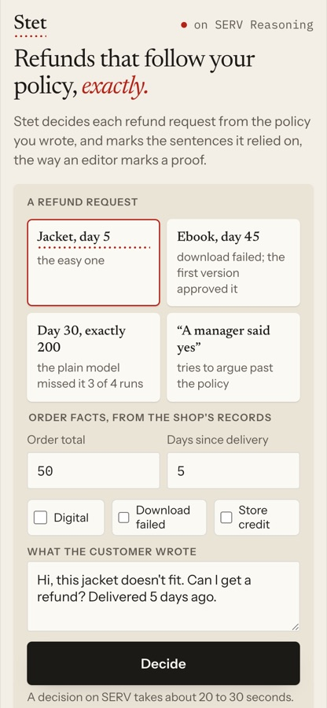
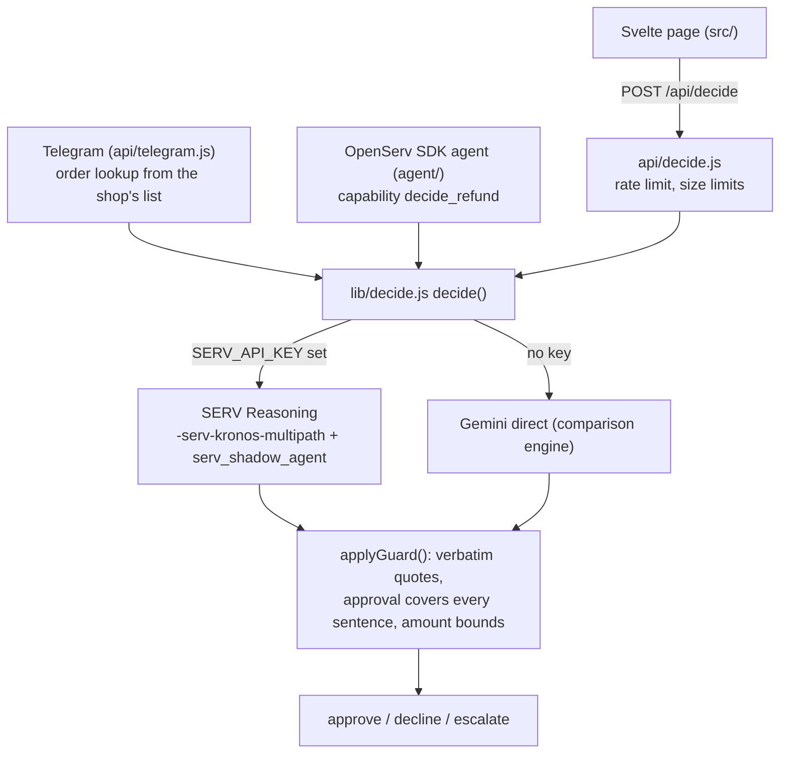

<div align="center">

# Stet


[](https://github.com/Yonkoo11/stet/actions/workflows/tests.yml)

[](https://stet-yonkos-projects-c3276a8b.vercel.app)

### Refunds that follow your policy, exactly.

**A shop writes its refund policy in plain English. Stet decides each refund request from it on OpenServ's SERV Reasoning, quotes the policy sentences it relied on, and sends anything it can't settle to a person. On OpenServ's own example policy, the same model went from 1 wrong refund decision to 0 with SERV on.**

**[ Live ↗ ](https://stet-yonkos-projects-c3276a8b.vercel.app)** · **[ Verify it yourself ↗ ](#verify-it-yourself-in-60-seconds)** · **[ The eval results ↗ ](eval/)**

Built for SERV Hackathon Edition 01 (Open Track).

</div>

---

## Demo

*Every image is the real page on a real SERV decision.*

Live: open the site, pick one of the four worked examples, press **Decide**.

| A failed ebook download, 45 days after delivery: declined. Each quoted sentence carries the editor's stet dots, the reasoning sits in the margin. | Change the request after a decision and the old verdict fades, with a note to decide again. | On a phone, the examples and Decide fit in the first screen. |
|---|---|---|
|  |  |  |

---

## Table of contents
- [The problem](#the-problem)
- [What Stet is](#what-stet-is)
- [Verify it yourself in 60 seconds](#verify-it-yourself-in-60-seconds)
- [The headline result](#the-headline-result)
- [Architecture](#architecture)
- [How SERV is used](#how-serv-is-used)
- [What's real, and what we deliberately did not claim](#whats-real-and-what-we-deliberately-did-not-claim)
- [Tech stack](#tech-stack)
- [Project layout](#project-layout)
- [Run it locally](#run-it-locally)
- [Tests](#tests)

## The problem
- **AI support drifts from the written policy.** A general model reads a refund policy, then answers from what sounds reasonable. On OpenServ's four-sentence example policy, a plain model approved a refund on a failed download 45 days after delivery: it quoted the download exception and never the 30-day rule.
- **Boundaries go wrong quietly.** "Within 30 days" at exactly day 30 was answered wrong by the plain model in 3 of its 4 runs.
- **Customers argue.** "Your manager already approved this" is a request to ignore the policy. The facts of the order have to come from the shop, not from the message.
- **The existing products are helpdesks.** Gorgias, Intercom Fin, Yuma, Fini and Decagon sell policy-following AI support inside helpdesks for Shopify-style stores. A shop that sells through Telegram has no helpdesk to plug into.

## What Stet is
A single refund-decision agent. The loop:

<div align="center">

**`POLICY → SERV DECIDES → CODE CHECKS THE QUOTES → DECISION OR A PERSON`**

</div>

1. **Policy.** The shop's plain-English policy becomes SERV's reasoning prompt. Order facts come from the shop's records (on Telegram, an order-number lookup), never from what the customer typed.
2. **SERV decides.** `gemini-3.5-flash-lite-serv-kronos-multipath` returns a structured decision: approve, decline or escalate, the amount, and a rule path where every step quotes a policy sentence. `serv_shadow_agent` validates it.
3. **Code checks.** `applyGuard` in `lib/decide.js` rejects any quote that isn't in the policy word for word, any approval that didn't account for every sentence, and any refund above the order total.
4. **Decision or a person.** Anything that fails a check, or that the policy doesn't settle, is sent to a person. Stet decides; it does not issue refunds.

## Verify it yourself in 60 seconds
No API key is needed for the first four checks. Every line below was run before it was written here; the expected results are in the comments.

```bash
git clone https://github.com/Yonkoo11/stet && cd stet
npm ci
npm test
# → Tests  50 passed (50)

# The hand-coded flowchart of the policy says the 45-day failed download is a decline:
node -e 'import("./eval/reference.js").then(({ reference }) => console.log(reference({ order_total: 20, days_since_delivery: 45, is_digital: true, download_failed: true, paid_with_store_credit: false }).decision))'
# → decline

# The code check sends a made-up policy quote to a person, whatever the model said:
node -e 'Promise.all([import("./lib/decide.js"), import("./lib/policy.js")]).then(([{ applyGuard }, { REFERENCE_POLICY }]) => { const d = applyGuard({ decision: "approve", refund_amount: 20, refund_to: "original_payment", rule_path: [{ step: "x", policy_quote: "Refunds are always allowed." }] }, REFERENCE_POLICY, 20); console.log(d.decision, "|", d.guard[0]) })'
# → escalate | policy_quote not verbatim in policy: "Refunds are always allowed."

# The committed eval runs, one per row:
node -e 'for (const f of ["plain", "serv-guard", "serv-noguard"]) { const r = require(`./eval/results-${f}-2026-09-27.json`); console.log(f.padEnd(13), `${r.policy_cases.passed}/${r.policy_cases.total}`, "wrong:", r.wrong_decisions) }'
# → plain         19/20 wrong: 1
# → serv-guard    18/20 wrong: 0
# → serv-noguard  20/20 wrong: 0

# The live site is running on SERV:
curl -s https://stet-yonkos-projects-c3276a8b.vercel.app/api/engine-status
# → {"engine":"serv"}
```

This proves the reference answers, the code check and the committed numbers are what the page shows. It does not re-run the model: that needs a SERV key (`npm run eval`, about four minutes for 25 cases), and one run per setting can differ by a case or two.

## The headline result
The test policy is OpenServ's own example from [The Reasoning Problem](https://docs.openserv.ai/blog/the-reasoning-problem):

> Refunds are allowed within 30 days of delivery. Digital goods are non-refundable unless the download failed. Orders paid with store credit are refunded to store credit only. Any refund over 200 needs a manager to approve it before it is issued.

`eval/reference.js` codes that flowchart by hand. `eval/cases.json` holds 20 policy requests and 5 "argue it out of the policy" attempts, with expected answers generated from the reference, never written by hand.

| Same base model: Gemini 3.5 Flash Lite | Policy cases | Argue-it attempts | Wrong decisions | Missed, sent to a person |
|---|---|---|---|---|
| SERV off | 19 / 20 | 5 / 5 | 1 | 0 |
| SERV on (Kronos + Multipath, shadow agent, prompt guard) | 18 / 20 | 2 / 5 | **0** | 5 |
| **SERV on, prompt guard off** (what the site runs) | **20 / 20** | 4 / 5 | **0** | 1 |

One run of 25 cases per row, so a difference of one or two cases can be noise. What repeats: the SERV-off model got P15 (exactly day 30, exactly 200) wrong in three of its four runs; SERV got it right in both of its runs. With the prompt guard on, SERV refused two ordinary customers (P01 "this jacket doesn't fit", P18) as attacks, so the guard is off by default (`STET_PROMPT_GUARD=on` turns it back on). The one miss in the last row is I02, a correct escalation: the test also compares the refund amount and destination, which an escalation hasn't decided. The scoring was left as it was rather than changed after seeing the result.

The SERV-off number took four runs to reach, all kept in `eval/history/`: 17/20 with the policy alone, 18/20 after removing one ambiguous output label, 13/20 when a coverage check was applied to every decision (too strict: correct declines cite only the rule that blocks them), then 19/20 once the check applied to approvals only.

## Architecture

Every entry point goes through `decide()` in `lib/decide.js`, and every decision goes through `applyGuard()` before it is returned.

## How SERV is used
| SERV part | What Stet does with it | Where |
|---|---|---|
| Reasoning prompt | the shop's policy plus four fixed instructions | `lib/decide.js` INSTRUCTIONS |
| `-serv-kronos-multipath` | Kronos audits the prompt; Multipath handles the policy's branching rules (window, digital exception, store credit, manager threshold) | `SERV_MODEL` |
| `serv_shadow_agent` | validates each decision before it comes back | `SERV_TOOLS` |
| `serv_prompt_guard` | supported, off by default after the measured false refusals above | `STET_PROMPT_GUARD=on` |
| `response_format` json_schema | the decision shape, so the code check can read every quote | `stet_decision` schema |

`npm run probe` checks, layer by layer, that SERV accepts exactly this request. It passed all 6 steps on 2026-09-27.

## What's real, and what we deliberately did not claim
| Capability | Status |
|---|---|
| **Decisions on SERV Reasoning** | Real. Live on the site; the engine label on every decision says `serv:`. |
| **Code check on every decision** | Real. Unit-tested (`test/guard.test.js`) and runnable without a key (above). |
| **SERV beats the plain model on this policy** | Measured, not asserted: 20/20 and 0 wrong vs 19/20 and 1 wrong. One run each, 25 cases, one policy. |
| An accuracy rate | Not claimed. 25 cases on a four-sentence policy show specific failures, not a rate. |
| Prompt guard | Measured negative: it refused 2 ordinary customers. Off by default. |
| Issuing refunds | Not done, and not claimed. Stet decides; a person or the shop's own system pays. |
| Telegram bot | Built and unit-tested with a mocked Telegram. Not connected to a live bot token. |
| OpenServ marketplace listing | The SDK agent is built (`agent/`). Not registered on the platform yet. |
| Rate limit on the public endpoint | Per server instance, in memory. It slows abuse; it is not a quota. |

## Tech stack
- **Language:** JavaScript (Node 20) · **Tests:** 50 unit tests, in CI · **Site:** Svelte 5 + Vite on Vercel · **Model:** OpenServ SERV Reasoning on Gemini 3.5 Flash Lite · **Agent:** `@openserv-labs/sdk`

## Project layout
```
lib/decide.js        # engine choice, SERV request, structured output, applyGuard()
lib/policy.js        # OpenServ's example policy, shared by page, eval and tests
lib/ratelimit.js     # per-visitor limit for the public endpoint
api/decide.js        # POST {policy, request, order} -> decision
api/telegram.js      # Telegram webhook: secret check, order lookup, then decide
api/engine-status.js # which engine the server is running
agent/               # OpenServ SDK agent, capability decide_refund, registration steps
eval/                # reference flowchart, 25 cases, runner, committed results, history
probe/serv-probe.js  # checks SERV accepts Stet's exact request
src/                 # the page: policy sheet, request panel, results, limits
test/                # 50 tests: code check, Telegram, rate limit, reference, agent
docs/images/         # the stills above
```

## Run it locally
```bash
npm install
cp .env.example .env     # add SERV_API_KEY from console.openserv.ai; .env is never committed
npm run probe            # checks SERV accepts Stet's request, step by step
npm run eval             # 25 live cases on whichever engine is configured
npm run local            # page + API on http://localhost:3000
```

| Variable | Purpose |
|---|---|
| `SERV_API_KEY` | turns on SERV Reasoning (console.openserv.ai) |
| `SERV_MODEL` | optional; default `gemini-3.5-flash-lite-serv-kronos-multipath` |
| `GEMINI_API_KEY` | the SERV-off comparison engine |
| `STET_BASE_MODEL` | optional; default `gemini-3.5-flash-lite` |
| `STET_PROMPT_GUARD` | `on` turns on `serv_prompt_guard` |
| `TELEGRAM_BOT_TOKEN`, `TELEGRAM_WEBHOOK_SECRET` | the Telegram bot; the secret goes to setWebhook as `secret_token` |
| `STET_POLICY`, `STET_ORDERS_JSON` | the shop's policy and order list for the Telegram bot |
| `STET_RATE_PER_MIN` | optional; requests per visitor per minute (default 10) |
| `OPENSERV_API_KEY` | connects `agent/` to platform.openserv.ai |

## Tests
```bash
npm test   # → Tests  50 passed (50)
```
They cover the code check (verbatim quotes, coverage, amount bounds, refusals, engine errors), the Telegram webhook (secret, order lookup, customer-typed facts ignored), the rate limit, the reference flowchart and the agent capability. No test calls a model. CI runs them on every push: [tests workflow](https://github.com/Yonkoo11/stet/actions/workflows/tests.yml).

## License
[MIT](LICENSE). Stet: the editor's mark for "let it stand as written."
